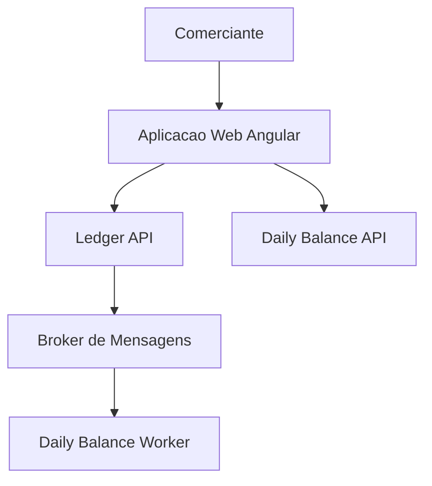
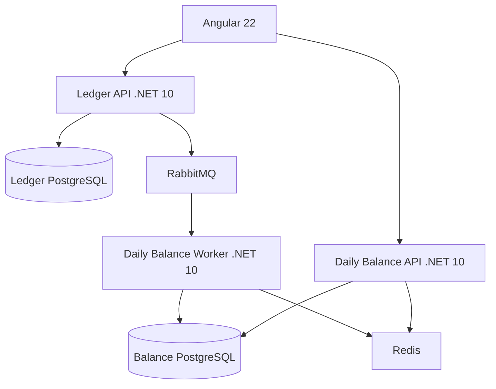

# Desafio de Arquiteto de Software - Especificacao da Documentacao Arquitetural

> Este documento instrui a IA a gerar toda a documentacao arquitetural do repositorio do desafio de fluxo de caixa. Os documentos devem ser tecnicos, coerentes com o codigo implementado e escritos em portugues do Brasil. Nao criar diagramas, metricas ou componentes que nao existam na solucao.

## 1. Contexto do desafio e objetivo da documentacao

O desafio pede uma solucao em C# para um comerciante controlar lancamentos diarios de credito e debito e consultar o saldo diario consolidado. Sao exigidos: desenho da solucao, testes, boas praticas, README, repositorio publico e documentacao do projeto.

O ponto nao funcional determinante e:

- O servico de lancamentos nao pode ficar indisponivel se o consolidado diario cair.
- O consolidado deve lidar com 50 requisicoes por segundo, com no maximo 5% de perda de requisicoes.

A documentacao precisa demonstrar maturidade de arquiteto: capacidade de decompor dominios, escolher padroes com justificativa, explicitar trade-offs, definir metas de confiabilidade e explicar como a solucao e observada e evolui em producao.

## 2. Perfil tecnico que a documentacao deve evidenciar

O autor tem experiencia pratica em arquitetura e desenvolvimento de sistemas corporativos, com foco em:

- C# e .NET moderno; para este projeto, **.NET 10**.
- Angular moderno; para este projeto, **Angular 22**.
- Clean Architecture, Arquitetura Hexagonal, SOLID, DDD pragmatico e CQRS quando justificado.
- PostgreSQL/SQL Server, EF Core e Dapper para cenarios em que leitura otimizada fizer sentido.
- Azure: AKS, Service Bus, Blob Storage, Key Vault, App Gateway, ACR, Azure DevOps e pipelines.
- Observabilidade com logs estruturados, Datadog, SonarQube, Snyk, NGINX, KEDA e integracoes assincronas.
- Lideranca tecnica, revisao de codigo, seguranca e engenharia de plataforma.

Use esse repertorio com equilibrio: demonstre experiencia real e criterio, sem transformar um desafio pequeno em uma plataforma corporativa superdimensionada.

## 3. Arquitetura de referencia que todos os documentos devem refletir

A solucao e composta por dois contextos independentes:

1. **Ledger**: recebe e persiste lancamentos financeiros; e o caminho critico de escrita.
2. **Daily Balance**: recebe eventos do Ledger e mantem uma projecao de saldo diario otimizada para consulta; inclui API de leitura e worker consumidor.

Tecnologias:

| Area | Decisao |
|---|---|
| Backend | .NET 10, ASP.NET Core, C# |
| Frontend | Angular 22, standalone components e signals |
| Dados | PostgreSQL, bancos/esquemas de responsabilidade isolada por servico |
| Integracao | RabbitMQ e MassTransit |
| Confiabilidade | Transactional Outbox no Ledger e Inbox/ProcessedMessages no Daily Balance |
| Cache | Redis para leitura do consolidado |
| Logs | Serilog estruturado |
| Telemetria | OpenTelemetry, traces, metricas e health checks |
| Testes | xUnit, FluentAssertions, Testcontainers |
| Carga | k6 |
| Execucao | Docker Compose |
| CI | GitHub Actions |

### Principio arquitetural central

O Ledger nunca chama o Daily Balance de forma sincrona. Ao registrar um lancamento, persiste o lancamento e a Outbox na mesma transacao. Um publisher envia os eventos ao RabbitMQ. O worker de consolidado atualiza sua projecao local de forma idempotente.

Consequencias declaradas:

- O registro de lancamento permanece disponivel quando o consolidado esta fora do ar.
- O saldo e eventualmente consistente.
- O broker pode reenviar mensagens, mas o efeito no saldo acontece uma unica vez.
- A leitura escala de forma independente da escrita.

## 4. Arquivos que a IA deve gerar

Criar os documentos abaixo dentro de `docs/`. Cada documento deve ter cabecalho, objetivo, escopo, decisao/descricao, consequencias e referencias internas quando aplicavel.

```text
docs/
├── architecture/
│   ├── 01-contexto-e-objetivos.md
│   ├── 02-visao-de-contexto-c4.md
│   ├── 03-visao-de-containers-c4.md
│   ├── 04-componentes-e-camadas.md
│   ├── 05-fluxos-principais.md
│   ├── 06-modelo-de-dados.md
│   └── 07-deployment-local-e-producao.md
├── adr/
│   ├── 001-separacao-de-contextos-ledger-e-daily-balance.md
│   ├── 002-integracao-assincrona-por-eventos.md
│   ├── 003-transactional-outbox-e-inbox.md
│   ├── 004-consistencia-eventual-e-ordenacao.md
│   ├── 005-observabilidade-e-correlation-id.md
│   ├── 006-cache-e-estrategia-de-leitura.md
│   └── 007-seguranca-e-exposicao-de-api.md
├── non-functional-requirements.md
├── resiliency-and-messaging.md
├── observability.md
├── security.md
├── api-contracts.md
├── testing-strategy.md
├── performance-and-capacity.md
├── operational-runbook.md
└── future-evolution.md
```

## 5. Conteudo obrigatorio de cada documento

### 5.1 `architecture/01-contexto-e-objetivos.md`

Explicar:

- Problema de negocio e atores: comerciante, aplicacao Angular e APIs.
- Requisitos funcionais: registrar credito/debito e consultar consolidado diario.
- Requisitos nao funcionais do desafio e metas adotadas.
- Premissas: valores positivos, data do negocio em UTC, eventos imutaveis e aditivos no escopo inicial.
- Fora de escopo: conciliacao bancaria, multimoeda, multiempresa, cancelamento/edicao e autenticacao corporativa completa.
- Glossario: Lancamento, Credito, Debito, Saldo Diario, Outbox, Inbox, DLQ, CorrelationId, CausationId, Idempotencia.

### 5.2 `architecture/02-visao-de-contexto-c4.md`

Apresentar diagrama C4 de contexto em Mermaid e texto explicativo.



Explicar que o comerciante nao interage diretamente com o broker e que o worker e um componente interno, nao uma API publica.

### 5.3 `architecture/03-visao-de-containers-c4.md`

Descrever todos os containers e seus protocolos, dados e responsabilidades:



Registrar que bancos separados representam propriedade de dados por contexto. Se houver uma unica instancia PostgreSQL no Docker local, usar bancos ou schemas separados e explicar que a separacao logica simula a independencia de dados.

### 5.4 `architecture/04-componentes-e-camadas.md`

Explicar a estrutura interna de cada backend seguindo Clean/Hexagonal Architecture:

- `Api`: controllers/endpoints, filtros, autenticacao, middleware de Correlation ID, Swagger e health checks.
- `Application`: casos de uso, comandos/queries, DTOs, validadores, interfaces e orquestracao.
- `Domain`: entidades, value objects, regras de negocio e eventos de dominio.
- `Infrastructure`: EF Core, repositorios, Outbox, MassTransit, Redis e integracoes tecnicas.

Explicar que CQRS e utilizado de modo pragmatico: escrita no Ledger e leitura por projecao no Daily Balance. Nao criar complexidade artificial com handlers desnecessarios.

### 5.5 `architecture/05-fluxos-principais.md`

Documentar em diagramas de sequencia Mermaid e em passos numerados:

1. Registro de lancamento com Outbox.
2. Publicacao de evento pendente.
3. Consumo idempotente e atualizacao de saldo.
4. Consulta de saldo com cache.
5. Queda do Daily Balance sem indisponibilizar o Ledger.
6. Falha de processamento, retry e envio a DLQ.

O fluxo de registro deve deixar claro que `Transaction` e `OutboxMessage` sao gravados na mesma transacao antes de qualquer publicacao.

### 5.6 `architecture/06-modelo-de-dados.md`

Criar diagrama ER Mermaid e explicar tabelas e indices:

Ledger:

- `transactions`: id, type, amount, occurred_at, description, idempotency_key, created_at.
- `outbox_messages`: id/event_id, type, payload, correlation_id, occurred_at, published_at, retry_count.
- Indice unico para `idempotency_key` e indice por data de ocorrencia.

Daily Balance:

- `daily_balances`: business_date, total_credits, total_debits, balance, updated_at.
- `processed_messages`: event_id, event_type, processed_at, correlation_id.
- Indice unico em `processed_messages.event_id` e indice/chave por `business_date`.

Explicar que `processed_messages` e atualizado na mesma transacao da projecao para impedir duplicidade em reentregas.

### 5.7 `architecture/07-deployment-local-e-producao.md`

Cobrir:

- Docker Compose com Angular, APIs, worker, RabbitMQ, PostgreSQL e Redis.
- Variaveis de ambiente e configuracoes por ambiente.
- Health checks `live` e `ready`.
- Producao Azure como evolucao: Azure Container Apps ou AKS, Azure Service Bus, Azure Cache for Redis, Azure Database for PostgreSQL HA, Application Insights, Key Vault, API Management e WAF.
- Autoscaling por CPU/memoria e profundidade de fila. Mencionar KEDA como opcao para workers orientados por fila.

## 6. ADRs - formato e decisoes

Cada ADR deve seguir exatamente:

```text
# ADR NNN - Titulo
Status: Aceita
Data: <data>

## Contexto
## Decisao
## Alternativas consideradas
## Consequencias positivas
## Consequencias negativas e mitigacoes
## Criterios de revisao
```

### ADR-001 - Separacao de contextos Ledger e Daily Balance

Decisao: dois servicos independentes, pois a indisponibilidade do consolidado nao pode afetar a escrita.

Alternativas e trade-offs:

- Monolito modular: mais simples e menor custo operacional, adequado se isolamento nao fosse um requisito.
- Dois servicos: maior complexidade operacional, porem isolamento de falha e escalabilidade independente.

### ADR-002 - Integracao assincrona por eventos

Decisao: RabbitMQ + MassTransit para desacoplamento temporal e de disponibilidade.

Alternativa descartada: chamada HTTP sincrona do Ledger ao consolidado, pois transforma a disponibilidade do consolidado em dependencia do caminho critico de escrita.

### ADR-003 - Transactional Outbox e Inbox

Decisao: Outbox no produtor e Inbox/ProcessedMessages no consumidor.

Explicar a janela de falha entre commit de banco e publish; a Outbox a elimina. Explicar que o broker e at-least-once, mas a projecao obtém exactly-once effect via deduplicacao transacional.

### ADR-004 - Consistencia eventual, ordenacao e reprocessamento

Decisao: saldo consolidado e uma projecao eventualmente consistente. Eventos do escopo inicial sao imutaveis e aditivos, logo sua ordem nao muda a soma final.

Explicar que duplicidade mudaria o resultado e, por isso, e bloqueada pela Inbox. Para futura edicao/cancelamento, incluir `TransactionId` e `EventVersion`; o consumidor deve ignorar versoes antigas e aplicar somente transicoes validas.

### ADR-005 - Observabilidade e Correlation ID

Decisao: propagar `X-Correlation-ID`, `CausationId`, `EventId`, `TraceId` e `SpanId` do request HTTP ate o consumidor. Gerar UUID quando `X-Correlation-ID` estiver ausente.

### ADR-006 - Cache para leitura do consolidado

Decisao: cache-aside com Redis para a consulta de saldo. Atualizar ou invalidar o cache apos atualizacao da projecao.

Explicar cache miss, TTL, possibilidade de dado momentaneamente defasado e fallback ao banco.

### ADR-007 - Seguranca e exposicao de API

Decisao: HTTPS em producao, JWT Bearer para endpoints protegidos, rate limiting, validacao de entrada e secrets fora do repositorio.

## 7. Requisitos nao funcionais mensuraveis

Gerar `non-functional-requirements.md` com a matriz abaixo e detalhamento de como cada item e atendido e verificado.

| Categoria | Meta | Estrategia de implementacao | Evidencia |
|---|---|---|---|
| Disponibilidade do Ledger | Nao depender do consolidado | Outbox e mensageria assincrona | Teste com worker/API de consolidado parada |
| Disponibilidade de consulta | 99,5% como meta proposta | Redis, indice e health checks | k6 e monitoramento |
| Erro sob carga | Menor que 5% a 50 RPS | cache, consultas simples e teste k6 | relatorio k6 real |
| Integridade | Sem duplicar efeito de evento | Inbox com EventId unico | teste de reentrega |
| Recuperacao | Nenhum evento confirmado e perdido | Outbox, retry e DLQ | testes de indisponibilidade |
| Observabilidade | Rastreabilidade ponta a ponta | CorrelationId e OpenTelemetry | logs/traces por fluxo |
| Seguranca | API protegida e entradas validas | JWT, rate limit, FluentValidation | testes e configuracao |

Nao afirmar disponibilidade absoluta ou perda zero. Distinguir SLO (meta interna), SLI (indicador medido) e resultado real do teste local.

## 8. Documento de mensageria e resiliencia

Em `resiliency-and-messaging.md`, explicar detalhadamente:

- Garantia de entrega at-least-once do broker.
- Por que exactly-once end-to-end nao e alegado; a solucao fornece exactly-once effect no banco de projeção.
- Outbox: polling/publicador, tentativas, marca de publicacao e observabilidade.
- Inbox: deduplicacao por EventId na mesma transacao da atualizacao de saldo.
- ACK somente apos commit local.
- Retry exponencial com jitter e limites claros.
- DLQ: quando usar, como diagnosticar e como reprocessar sem duplicar saldo.
- Eventos fora de ordem: seguros para o modelo aditivo atual; estrategia de versao por agregado para eventos mutaveis futuros.
- Atualizacao atomica com UPSERT/operacao incremental, evitando race conditions.

Incluir uma tabela de cenarios de falha:

| Falha | Efeito esperado | Mecanismo de protecao | Acao operacional |
|---|---|---|---|
| Daily Balance indisponivel | Ledger continua aceitando lancamentos | Outbox + broker | Restaurar consumidor e acompanhar backlog |
| RabbitMQ indisponivel | Lancamento confirmado; evento pendente | Outbox Publisher com retry | Monitorar Outbox nao publicada |
| Worker cai antes do ACK | Mensagem pode ser redeliver | Inbox idempotente | Nenhuma correcao manual esperada |
| Mensagem invalida | Nao bloquear fila principal | Retry limitado + DLQ | Corrigir causa e reprocessar |
| Redis indisponivel | Consulta mais lenta, mas funcional | Fallback PostgreSQL | Restaurar Redis e observar latencia |

## 9. Documento de observabilidade

Em `observability.md`, documentar:

- Middleware de `X-Correlation-ID`: recebe, valida ou gera o identificador e devolve no response.
- Propagacao em headers/metadados do RabbitMQ.
- Diferenca entre CorrelationId (jornada), CausationId (origem imediata), EventId (identidade do evento), TraceId e SpanId (telemetria).
- Serilog com logs estruturados; nao usar logs concatenados como unica fonte de analise.
- Campos obrigatorios: `Service`, `Environment`, `CorrelationId`, `CausationId`, `TraceId`, `SpanId`, `EventId`, `MessageId`, `TransactionId`, `BusinessDate`, `OperationName`, `ElapsedMs` e `Exception`.
- Metricas: taxa de requisicoes, erros, latencia p50/p95/p99, tamanho da Outbox pendente, mensagens na fila, retries, DLQ e cache hit ratio.
- Tracing para HTTP, PostgreSQL e mensageria.
- Alertas sugeridos: aumento de erro 5xx, p95 acima da meta, Outbox acumulada, DLQ maior que zero e consumidor sem atividade.

Incluir um exemplo de jornada que a equipe consegue rastrear pelo mesmo CorrelationId do POST ate o saldo atualizado.

## 10. Documento de seguranca

Em `security.md`, cobrir:

- Autenticacao e autorizacao por JWT Bearer, com configuracao de desenvolvimento simples e segura.
- Validacao de payload e tratamento padronizado de erros sem expor detalhes internos.
- Rate limiting nas APIs publicas.
- TLS/HTTPS e cabecalhos de seguranca em producao.
- Segredos por variavel de ambiente no local e Azure Key Vault em producao.
- Principio do menor privilegio para bancos e broker.
- Sanitizacao de logs e proibicao de tokens/senhas/dados sensiveis nos logs.
- Dependencias atualizadas, SCA com Snyk e qualidade estatica com SonarQube como evolucao de pipeline.

## 11. Contratos de API

Em `api-contracts.md`, documentar:

- Endpoint, verbo, proposito, headers requeridos, request, response, codigos HTTP e erros.
- `POST /api/v1/transactions` com `Idempotency-Key` e `X-Correlation-ID`.
- `GET /api/v1/transactions?date=...`.
- `GET /api/v1/daily-balances/{date}`.
- Health checks `live` e `ready`.
- Convencao de erros baseada em Problem Details.
- Swagger/OpenAPI como fonte de contrato executavel.

## 12. Testes, performance e operacao

### `testing-strategy.md`

Definir piramide de testes e cenarios obrigatorios: dominio, validacoes, persistencia + Outbox, indisponibilidade do broker/consolidado, reentrega, ordem de eventos, DLQ e propagacao de CorrelationId. Informar que Testcontainers prova o comportamento com dependencias reais sem exigir ambiente externo.

### `performance-and-capacity.md`

Definir metodologia de carga com k6: seed de dados, aquecimento, carga constante de 50 RPS, duracao, thresholds, coleta de p95 e taxa de erro. Declarar que resultados de notebook local nao sao garantia de producao; devem servir como evidencia reprodutivel.

### `operational-runbook.md`

Criar procedimentos curtos para:

1. Broker indisponivel e Outbox acumulada.
2. Consumidor parado.
3. Mensagens em DLQ.
4. Cache Redis indisponivel.
5. Aumento de latencia/erros no endpoint de consulta.
6. Rastrear uma operacao pelo CorrelationId.

Para cada procedimento: sintoma, dados a verificar, acao segura, criterio de recuperacao e registro posterior.

## 13. Evolucao futura

Em `future-evolution.md`, separar explicitamente o que nao entrou no escopo, mas foi pensado:

- Multitenancy e segregacao por comerciante.
- Cancelamento/edicao de lancamentos com versao de eventos e compensacao.
- Auditoria imutavel, retencao e LGPD.
- Particionamento por comerciante/data em volumes maiores.
- Read replicas e cache distribuido em producao.
- Event schema registry e versionamento formal de contratos.
- Sagas somente se surgirem processos de negocio distribuidos que realmente precisem de coordenacao.
- Azure Service Bus, AKS/Container Apps e KEDA conforme necessidade operacional.
- Dashboards, SLOs formais e alertas de operacao.

## 14. Regras de qualidade da escrita

- Escrever de forma objetiva e profissional, sem frases vagas como "a arquitetura e escalavel" sem explicar como e sob qual premissa.
- Distinguir claramente o que foi implementado, o que foi validado por teste e o que e evolucao sugerida.
- Toda decisao deve ter contexto, alternativa, consequencia e mitigacao.
- Diagramas Mermaid devem ser pequenos, renderizaveis e coerentes com os nomes do codigo.
- Nao afirmar que RabbitMQ garante exactly-once delivery.
- Nao prometer que cache elimina consistencia eventual.
- Nao usar termos como microservicos, DDD ou CQRS apenas como rotulo; explicar a aplicacao concreta no projeto.
- Referenciar documentos relacionados por links Markdown relativos.

## 15. Criterio de aceite da documentacao

A documentacao esta pronta quando um avaliador consegue responder, sem ler todo o codigo:

1. Por que o Ledger continua disponivel se o consolidado cair?
2. Como um evento nao se perde entre banco e mensageria?
3. Como reentrega ou reprocessamento nao duplica o saldo?
4. Por que eventos fora de ordem nao corrompem o modelo atual?
5. Como rastrear uma requisicao da API ao worker?
6. Como a consulta suporta 50 RPS e como isso sera medido?
7. Quais sao os trade-offs de consistencia eventual e servicos separados?
8. Como executar, testar e operar a solucao localmente?

Se qualquer resposta depender de suposicao ou de uma afirmacao que o codigo nao sustenta, corrigir o codigo ou ajustar a documentacao antes da entrega.

