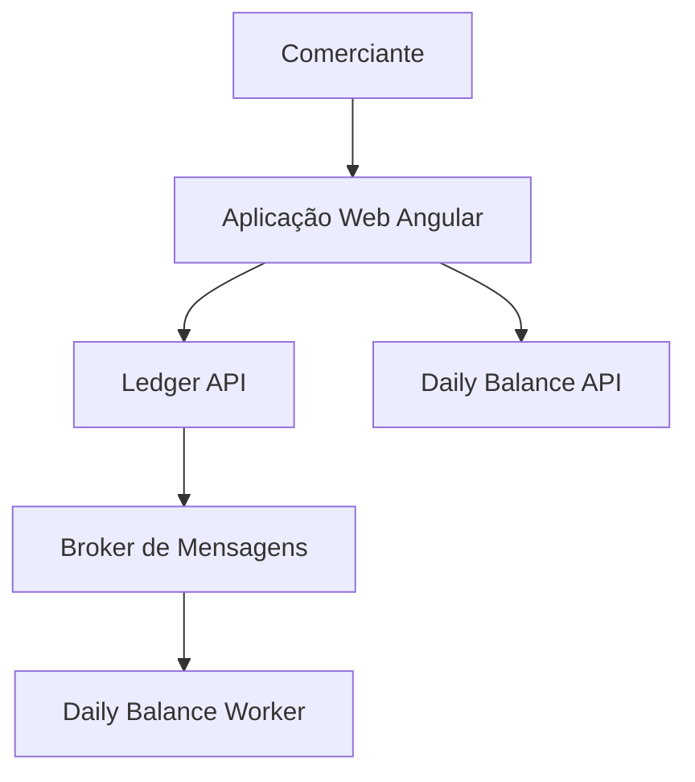

# 02 — Visão de Contexto (C4 — Nível 1)

## Objetivo

Mostrar a solução como uma caixa-preta em relação ao seu usuário e aos sistemas que a
compõem em alto nível, sem detalhar protocolos ou tecnologias internas.

## Escopo

Nível de contexto do modelo C4. Para os containers (serviços, bancos, broker) e seus
protocolos, ver [03-visao-de-containers-c4.md](03-visao-de-containers-c4.md).

## Diagrama

## Descrição

- O **comerciante** é o único ator humano do sistema. Ele interage exclusivamente com a
  **Aplicação Web**.
- A **Aplicação Web** consome duas APIs HTTP distintas: a **Ledger API**, para registrar e
  consultar lançamentos, e a **Daily Balance API**, para consultar o saldo consolidado.
- A **Ledger API** publica eventos no **Broker de Mensagens** sempre que um lançamento é
  registrado. O comerciante e a aplicação Web **não interagem diretamente com o broker** —
  ele é um detalhe de implementação da integração entre os dois contextos.
- O **Daily Balance Worker** é um componente interno, sem interface HTTP pública, que
  consome os eventos do broker e atualiza a projeção de saldo consumida pela Daily Balance
  API. Ele não é uma API e não é chamado diretamente pela aplicação Web.

Essa separação — comerciante fala com a Web, Web fala com as duas APIs, só a Ledger API fala
com o broker, e o worker é 100% interno — é o que permite que a indisponibilidade do
consolidado (Daily Balance API e/ou Worker) nunca impeça o registro de um lançamento. O
racional completo dessa decisão está no [ADR-001](../adr/001-separacao-de-contextos-ledger-e-daily-balance.md).

## Referências

- [01 — Contexto e Objetivos](01-contexto-e-objetivos.md)
- [03 — Visão de Containers](03-visao-de-containers-c4.md)
- [ADR-001 — Separação de contextos](../adr/001-separacao-de-contextos-ledger-e-daily-balance.md)
- [ADR-002 — Integração assíncrona por eventos](../adr/002-integracao-assincrona-por-eventos.md)
