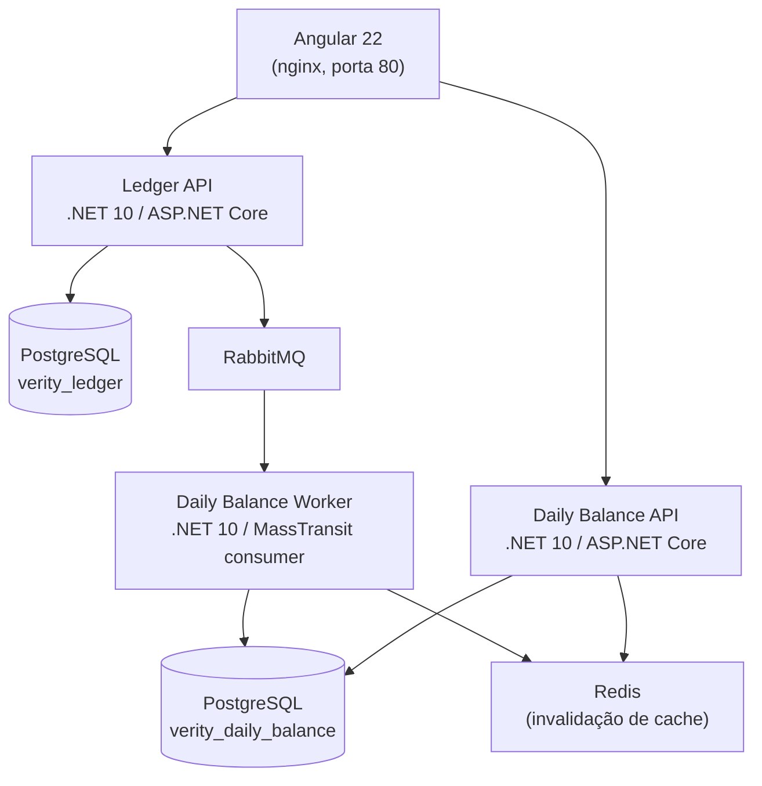

# 03 — Visão de Containers (C4 — Nível 2)

## Objetivo

Detalhar os containers (no sentido C4 — unidades de execução implantáveis) que compõem a
solução, seus protocolos de comunicação, os dados que cada um possui e sua responsabilidade.

## Escopo

Nível de containers do modelo C4, refletindo exatamente os serviços definidos em
`docker-compose.yml` na raiz do repositório. Para a estrutura interna de cada backend, ver
[04-componentes-e-camadas.md](04-componentes-e-camadas.md).

## Diagrama

## Containers

| Container | Tecnologia | Protocolo de entrada | Dados que possui | Responsabilidade |
|---|---|---|---|---|
| Angular Web | Angular 22 (standalone + signals), servido por nginx | HTTP | Nenhum dado persistente próprio | Interface do comerciante; consome as duas APIs via HTTP/JSON. |
| Ledger API | .NET 10 / ASP.NET Core | HTTPS/HTTP (REST/JSON) | `transactions`, `outbox_messages` (schema `ledger`) | Caminho crítico de escrita: valida e persiste lançamentos; publica eventos de integração via Outbox. |
| Daily Balance API | .NET 10 / ASP.NET Core | HTTPS/HTTP (REST/JSON) | Lê `daily_balances` (schema `daily_balance`); lê/escreve cache Redis | Caminho de leitura: expõe o saldo diário consolidado, otimizado por cache. |
| Daily Balance Worker | .NET 10 / MassTransit (consumidor) | AMQP (consome do RabbitMQ) | Escreve `daily_balances`, `processed_messages` (schema `daily_balance`); invalida cache Redis | Consome eventos de lançamento de forma assíncrona e idempotente, atualizando a projeção de saldo. |
| PostgreSQL | PostgreSQL 16 | TCP/SQL | Bancos `verity_ledger` e `verity_daily_balance` | Persistência transacional de cada contexto. |
| RabbitMQ | RabbitMQ 3 (plugin de management) | AMQP 0-9-1 | Filas e exchanges do MassTransit | Broker de mensagens para a integração assíncrona entre Ledger e Daily Balance. |
| Redis | Redis 7 | RESP (TCP) | Chave `daily-balance:{data}` com TTL de 30s (padrão) | Cache-aside da consulta de saldo diário. |

## Sobre a instância única de PostgreSQL

Em ambiente local (Docker Compose), os dois contextos rodam sobre a **mesma instância** de
PostgreSQL, mas em **bancos de dados distintos** (`verity_ledger` e `verity_daily_balance`),
criados por `deploy/postgres/init-databases.sh`, e cada `DbContext` usa sua própria tabela de
histórico de migração (schemas `ledger` e `daily_balance` respectivamente). Nenhuma query
cruza os dois bancos: cada serviço só enxerga o seu.

Essa separação lógica **simula** a independência de dados por contexto que existiria com
instâncias físicas separadas — usada aqui para simplificar a execução local (um único
container de banco). Em produção, a recomendação é que cada contexto tenha sua própria
instância gerenciada (ver [07-deployment-local-e-producao.md](07-deployment-local-e-producao.md)
e [ADR-001](../adr/001-separacao-de-contextos-ledger-e-daily-balance.md)), eliminando
inclusive o compartilhamento de recursos de infraestrutura (CPU, IO, conexões) entre os dois
contextos.

## Portas expostas ao host (ambiente local)

| Container | Porta no host | Porta interna |
|---|---|---|
| Angular Web | 4201 | 80 |
| Ledger API | 5080 | 8080 |
| Daily Balance API | 5081 | 8080 |
| Daily Balance Worker (health checks) | 5082 | 8081 |
| PostgreSQL | 5433 | 5432 |
| RabbitMQ (AMQP) | 5673 | 5672 |
| RabbitMQ (management UI) | 15673 | 15672 |
| Redis | 6380 | 6379 |

As portas fogem dos valores default (5432, 5672, 6379, 4200 etc.) para não colidir com outros
serviços que já possam estar rodando na máquina do desenvolvedor.

## Referências

- [02 — Visão de Contexto](02-visao-de-contexto-c4.md)
- [04 — Componentes e Camadas](04-componentes-e-camadas.md)
- [06 — Modelo de Dados](06-modelo-de-dados.md)
- [07 — Deployment local e produção](07-deployment-local-e-producao.md)
