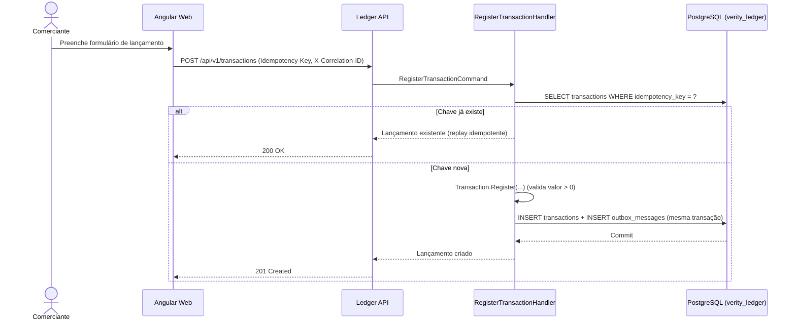
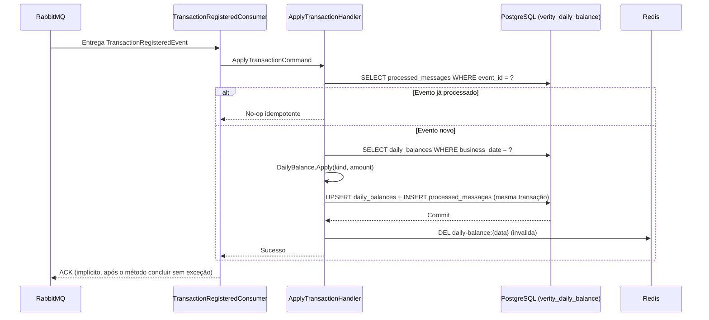
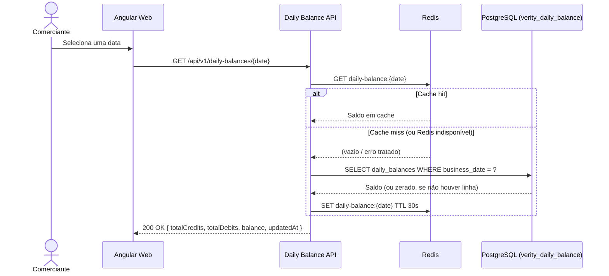
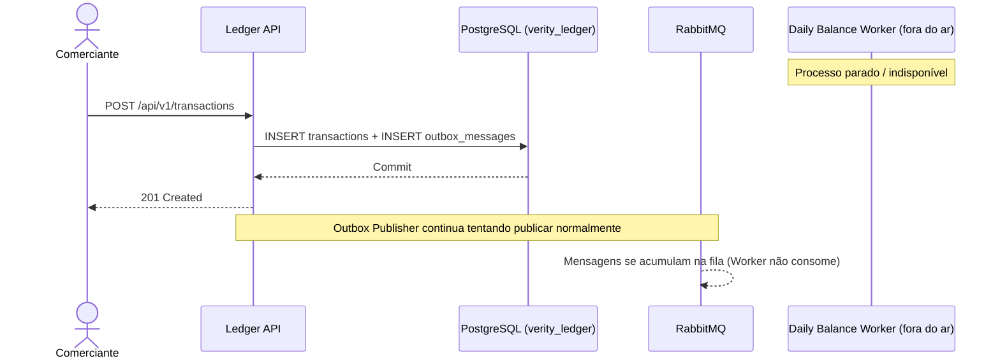
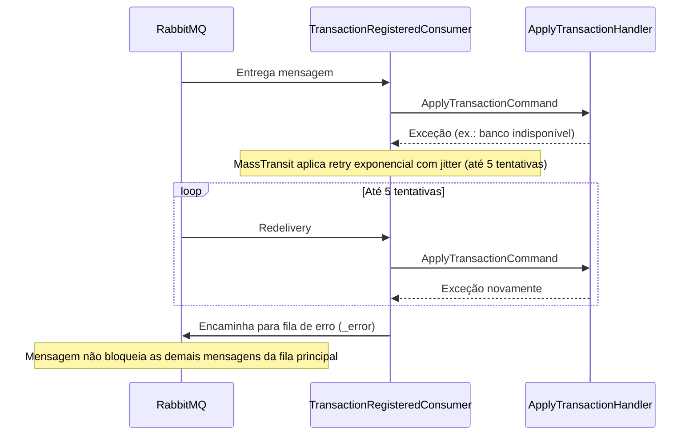

# 05 — Fluxos Principais

## Objetivo

Documentar, em diagramas de sequência e passos numerados, os fluxos que sustentam as
garantias de disponibilidade, integridade e consistência eventual da solução.

## Escopo

Fluxos de runtime entre os componentes já apresentados em
[03-visao-de-containers-c4.md](03-visao-de-containers-c4.md). Para os detalhes de código por
camada, ver [04-componentes-e-camadas.md](04-componentes-e-camadas.md).

## 1. Registro de lançamento com Outbox



Passos:

1. O comerciante submete o formulário; a Web envia `POST /api/v1/transactions` com os
   cabeçalhos `Idempotency-Key` (obrigatório) e `X-Correlation-ID` (opcional — gerado pela Api
   se ausente).
2. `RegisterTransactionHandler` verifica se já existe um lançamento com aquela
   `Idempotency-Key`. Se existir, retorna o lançamento existente sem criar nada novo (200 OK).
3. Caso contrário, `Transaction.Register(...)` valida as invariantes de domínio (valor
   positivo) e levanta o evento de domínio `TransactionRegisteredDomainEvent`.
4. O handler grava, **na mesma transação de banco**, a linha em `transactions` e a mensagem
   correspondente em `outbox_messages` (`IUnitOfWork.SaveChangesAsync`). Só depois desse
   commit a Api responde 201 Created.

Neste ponto, o lançamento está durável e a intenção de publicar o evento também — mesmo que o
RabbitMQ esteja fora do ar agora, nada foi perdido.

## 2. Publicação de evento pendente (Outbox Publisher)

```mermaid
sequenceDiagram
    participant Publisher as OutboxPublisherService
    participant Db as PostgreSQL (verity_ledger)
    participant Bus as IPublishEndpoint (MassTransit)
    participant Rabbit as RabbitMQ

    loop A cada ciclo de polling (padrão 2s)
        Publisher->>Db: SELECT outbox_messages WHERE published_at IS NULL (lote)
        alt Há mensagens pendentes
            Publisher->>Bus: Publish(evento desserializado)
            Bus->>Rabbit: Publica no exchange
            Rabbit-->>Bus: Confirmação
            Bus-->>Publisher: OK
            Publisher->>Db: UPDATE outbox_messages SET published_at = now()
        else Falha ao publicar
            Publisher->>Db: UPDATE outbox_messages SET retry_count += 1, last_error = ...
            Note over Publisher: Mensagem permanece pendente; será tentada de novo no próximo ciclo
        end
    end
```

Passos:

1. `OutboxPublisherService` (BackgroundService no processo da Ledger API) varre
   periodicamente `outbox_messages` em busca de linhas com `published_at IS NULL`, em lotes
   (`OutboxPublisher:BatchSize`, padrão 50).
2. Para cada mensagem, desserializa o payload conforme o `Type` gravado e publica via
   `IPublishEndpoint.Publish`, propagando `CorrelationId` e `CausationId` da linha da Outbox
   para o contexto da mensagem.
3. Em caso de sucesso, marca `published_at`. Em caso de falha (ex.: RabbitMQ indisponível),
   incrementa `retry_count` e registra `last_error`, mas **não** derruba o processo nem
   bloqueia as demais mensagens do lote — a mensagem volta a ser candidata no próximo ciclo.

## 3. Consumo idempotente e atualização de saldo



Passos:

1. O `TransactionRegisteredConsumer` (MassTransit) recebe o evento do RabbitMQ.
2. `ApplyTransactionHandler` primeiro checa a Inbox (`processed_messages`) pelo `EventId`.
   Se já existe, é uma reentrega e nada é alterado — a operação retorna como sucesso sem
   tocar no saldo.
3. Caso contrário, carrega (ou cria) a projeção `daily_balances` da data de negócio do
   evento, aplica o efeito (`DailyBalance.Apply`) e grava a projeção atualizada **e** a marca
   de processamento na mesma transação de banco.
4. Após o commit, o cache Redis daquela data é invalidado (cache-aside).
5. O MassTransit só confirma (ACK) a mensagem ao RabbitMQ depois que o método `Consume`
   retorna sem lançar exceção — ou seja, depois que a transação de banco já foi commitada.
   Se o processo cair entre o commit e o ACK, o broker reentrega a mensagem; como o `EventId`
   já está na Inbox, o reprocessamento é um no-op seguro.

## 4. Consulta de saldo com cache



Passos:

1. A Api consulta primeiro o Redis (`GetDailyBalanceHandler`, cache-aside).
2. Em caso de acerto, responde imediatamente com o valor em cache.
3. Em caso de erro (chave ausente **ou** falha de conexão com o Redis — ambos tratados da
   mesma forma no código, ver [ADR-006](../adr/006-cache-e-estrategia-de-leitura.md)),
   consulta o PostgreSQL e repopula o cache com TTL de 30 segundos (padrão,
   `Redis:TimeToLive`).
4. Datas sem nenhum lançamento retornam saldo zerado (200 OK), não 404 — a ausência de
   lançamentos é um estado válido, não um erro.

## 5. Queda do Daily Balance sem indisponibilizar o Ledger



Passos:

1. O Ledger não tem nenhuma dependência síncrona do Daily Balance Worker nem da Daily
   Balance API — nenhuma chamada HTTP, nenhuma consulta ao banco do outro contexto.
2. Um lançamento é registrado normalmente: grava no banco do Ledger, responde 201. O Outbox
   Publisher publica a mensagem no RabbitMQ como sempre (o broker é uma dependência do
   Ledger, não o Worker).
3. Como o Worker está fora do ar, a mensagem fica acumulada na fila do RabbitMQ, aguardando.
   Quando o Worker voltar, ele consome o backlog normalmente — de forma idempotente, sem
   duplicar efeito mesmo que alguma mensagem tenha sido parcialmente processada antes da
   queda.
4. Enquanto isso, a consulta de saldo (Daily Balance API) pode retornar dados desatualizados
   ou ficar indisponível — mas isso nunca bloqueia o registro de novos lançamentos.

## 6. Falha de processamento, retry e DLQ



Passos:

1. Se `ApplyTransactionHandler` lançar uma exceção (ex.: PostgreSQL momentaneamente
   indisponível), o MassTransit intercepta a falha no pipeline do consumidor.
2. A política configurada (`UseMessageRetry` com `Exponential`, 5 tentativas, intervalo
   inicial de 200ms e máximo de 10s, com incremento de 200ms) tenta reprocessar a mensagem
   automaticamente, sem intervenção manual.
3. Se todas as tentativas falharem, o MassTransit encaminha a mensagem para a fila de erro
   associada ao receive endpoint (convenção `{queue}_error`, criada automaticamente pelo
   transporte RabbitMQ) — a chamada **DLQ** deste sistema. A fila principal continua
   processando as próximas mensagens normalmente.
4. Reprocessar uma mensagem da DLQ depois de corrigida a causa raiz é seguro: o `EventId` só
   é gravado na Inbox após sucesso, então a mensagem original nunca foi aplicada ao saldo —
   reenviá-la não duplica efeito algum.

## Referências

- [ADR-002 — Integração assíncrona por eventos](../adr/002-integracao-assincrona-por-eventos.md)
- [ADR-003 — Transactional Outbox e Inbox](../adr/003-transactional-outbox-e-inbox.md)
- [Mensageria e resiliência](../resiliency-and-messaging.md)
- [Runbook operacional](../operational-runbook.md)
