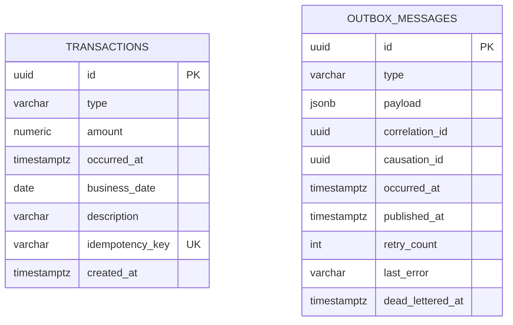
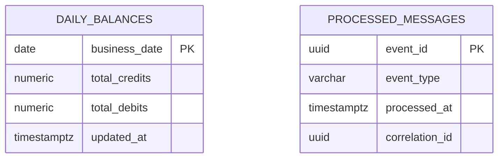

# 06 — Modelo de Dados

## Objetivo

Descrever as tabelas, colunas e índices de cada banco, e explicar como a Inbox garante que
reentregas do broker não dupliquem o efeito no saldo.

## Escopo

Modelo físico (EF Core + PostgreSQL, com `EFCore.NamingConventions` convertendo para
snake_case) dos bancos `verity_ledger` e `verity_daily_balance`. Não cobre os DTOs de
API — ver [api-contracts.md](../api-contracts.md).

## Diagrama (Ledger)

`transactions` e `outbox_messages` não têm relacionamento de chave estrangeira entre si — a
ligação é feita pelo conteúdo do payload (`TransactionId`) e garantida pela atomicidade da
transação que grava as duas linhas juntas, não por uma FK.

### `transactions`

| Coluna | Tipo | Observação |
|---|---|---|
| `id` | `uuid` | PK, gerada pela aplicação (`Guid.NewGuid()`, `ValueGeneratedNever`). |
| `type` | `varchar(16)` | `Credit` ou `Debit` (enum convertido para string). |
| `amount` | `numeric(18,2)` | Sempre positivo (validado no domínio e no `FluentValidation`). |
| `occurred_at` | `timestamptz` | Instante de ocorrência do lançamento, em UTC. |
| `business_date` | `date` | Derivado de `occurred_at`; usado para consolidação e consulta. |
| `description` | `varchar(500)` | Opcional. |
| `idempotency_key` | `varchar(128)` | Chave enviada pelo cliente no header `Idempotency-Key`. |
| `created_at` | `timestamptz` | Instante em que o lançamento foi persistido. |

Índices: **único** em `idempotency_key` (`ix_transactions_idempotency_key`) — é essa
restrição que garante, no nível do banco, que uma requisição concorrente com a mesma chave
não crie dois lançamentos (ver `UnitOfWork.IsUniqueIdempotencyKeyViolation` em
`Verity.Ledger.Infrastructure`); e não-único em `business_date`
(`ix_transactions_business_date`), usado pela consulta `GET /api/v1/transactions?date=`.

### `outbox_messages`

| Coluna | Tipo | Observação |
|---|---|---|
| `id` | `uuid` | PK; identidade da linha da Outbox (não confundir com `EventId`, que fica dentro do `payload`). |
| `type` | `varchar(256)` | Nome completo do tipo CLR do evento (usado para desserializar antes de publicar). |
| `payload` | `jsonb` | Evento de integração serializado (`TransactionRegisteredEvent`). |
| `correlation_id` | `uuid` | Propagado do request HTTP que originou o lançamento. |
| `causation_id` | `uuid` | Origem imediata do evento — no fluxo atual, igual ao `correlation_id`, pois o evento nasce diretamente do request HTTP (ver [observability.md](../observability.md)). |
| `occurred_at` | `timestamptz` | Quando a linha foi gravada (mesma transação do lançamento). |
| `published_at` | `timestamptz`, nulo | Preenchido pelo `OutboxPublisherService` após confirmação de publicação. `NULL` = pendente. |
| `retry_count` | `int` | Incrementado a cada tentativa de publicação malsucedida (transitória ou permanente). |
| `last_error` | `varchar(2000)`, nulo | Última mensagem de erro de publicação, para diagnóstico. |
| `dead_lettered_at` | `timestamptz`, nulo | Preenchido pelo `OutboxPublisherService` quando a falha é permanente (tipo de evento desconhecido ou payload corrompido — ver [resiliency-and-messaging.md](../resiliency-and-messaging.md)). `NULL` = ainda elegível para publicação automática. |

Índices: não-único em `published_at` (`ix_outbox_messages_published_at`) e em
`dead_lettered_at` (`ix_outbox_messages_dead_lettered_at`), usados pelo Outbox Publisher para
encontrar rapidamente as mensagens pendentes (`WHERE published_at IS NULL AND
dead_lettered_at IS NULL`).

> `causation_id` não está na lista mínima de colunas do desafio, mas foi incluído porque o
> ADR-005 exige propagar CausationId ponta a ponta — sem essa coluna a Outbox não teria como
> carregar esse dado até a publicação.

## Diagrama (Daily Balance)

### `daily_balances`

| Coluna | Tipo | Observação |
|---|---|---|
| `business_date` | `date` | **Chave primária** — uma linha por data de negócio. |
| `total_credits` | `numeric(18,2)` | Soma de todos os créditos aplicados àquela data. |
| `total_debits` | `numeric(18,2)` | Soma de todos os débitos aplicados àquela data. |
| `updated_at` | `timestamptz` | Última vez que a projeção foi atualizada. |

`balance` (`total_credits - total_debits`) **não é uma coluna** — é calculado em memória pela
propriedade `DailyBalance.Balance` sempre que a entidade é lida, e exposto assim na resposta
da API. Isso evita que o saldo persistido divirja da soma de créditos/débitos por um bug de
atualização parcial.

### `processed_messages`

| Coluna | Tipo | Observação |
|---|---|---|
| `event_id` | `uuid` | **Chave primária** — é o `EventId` do evento de integração consumido. |
| `event_type` | `varchar(256)` | Nome do comando aplicado (hoje, sempre `ApplyTransactionCommand`). |
| `processed_at` | `timestamptz` | Quando o evento foi efetivamente aplicado à projeção. |
| `correlation_id` | `uuid` | Copiado do evento consumido, para rastreabilidade. |

A restrição de unicidade exigida para a Inbox (um evento não pode ser aplicado duas vezes) é
garantida pela **própria chave primária** em `event_id` — não há necessidade de um índice
único adicional. `processed_messages` é gravada **na mesma transação de banco** que a
atualização de `daily_balances` (`ApplyTransactionHandler` + `UnitOfWork.SaveChangesAsync`):
se a mensagem já foi processada, uma tentativa concorrente de processá-la de novo viola essa
chave primária e a transação inteira (incluindo o incremento de saldo) é revertida — impedindo
duplicidade mesmo sob concorrência (`DuplicateEventException`, ver
[05-fluxos-principais.md](05-fluxos-principais.md#3-consumo-idempotente-e-atualização-de-saldo)).

## Referências

- [05 — Fluxos principais](05-fluxos-principais.md)
- [ADR-003 — Transactional Outbox e Inbox](../adr/003-transactional-outbox-e-inbox.md)
- [ADR-004 — Consistência eventual e ordenação](../adr/004-consistencia-eventual-e-ordenacao.md)
- [Contratos de API](../api-contracts.md)
